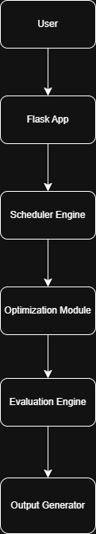

# 🎓 Intelligent Academic Timetable Scheduling System

## 🚀 Overview

The **Intelligent Academic Timetable Scheduling System** is an AI-driven deliberative planning agent designed to automatically generate optimized, conflict-free academic timetables for universities and educational institutions.

🌐 **Live Demo:**  
👉 https://intelligent-timetable.onrender.com  

📂 **GitHub Repository:**  
👉 https://github.com/Harsha30012005/Intelligent-Academic-Timetable-Scheduling-System  

---

The system integrates:

- Constraint Satisfaction (CSP)
- Optimization Techniques
- Hybrid AI Planning Strategies

to handle complex academic scheduling constraints efficiently.

---
## 🚀 Project Overview

Academic timetable scheduling is a complex combinatorial optimization problem involving multiple interdependent constraints such as:

- Faculty availability  
- Classroom capacity  
- Laboratory requirements  
- Batch overlaps  
- Faculty workload limits  
- Time slot balancing  
- Resource utilization efficiency  

Manual scheduling often leads to:
- Conflicts  
- Underutilized resources  
- Overloaded faculty  
- Imbalanced schedules  

This system solves the problem using a **Hybrid AI approach** combining:

- Constraint Satisfaction (CSP)
- Optimization-based heuristics
- Multi-objective scoring

---

## 🧠 AI Architecture

### 🔹 Hard Constraints
- No teacher conflicts
- No batch overlaps
- Room type validation (Lab/Theory)
- Teacher daily workload limit
- Consecutive slots for labs/projects
- Teacher unavailability enforcement

### 🔹 Soft Constraints (Optimized via Scoring)
- Day distribution balance
- Teacher workload fairness
- Room utilization balance

---

## 🧠 AI Architecture

### 🔹 Hard Constraints
- No teacher conflicts
- No batch overlaps
- Room type validation (Lab/Theory)
- Teacher daily workload limit
- Consecutive slots for labs/projects
- Teacher unavailability enforcement

### 🔹 Soft Constraints (Optimized via Scoring)
- Day distribution balance
- Teacher workload fairness
- Room utilization balance

---

## 📊 Advanced AI Evaluation Metrics

The system computes intelligent evaluation metrics:

- 📈 Room Utilization %
- ⚖ Teacher Fairness Score
- 📅 Day Balance Score
- 🌍 Global Efficiency Score
- 📋 Course Coverage Validation
- ⚠ Feasibility Analysis

---

## 🖥 Features

✔ Multi-page Professional Dashboard  
✔ Landing Page + Scheduling Dashboard  
✔ Analytics Page  
✔ Coverage Validation Page  
✔ CSV Upload System  
✔ Dynamic Optimization Weights  
✔ PDF Export (Structured Format)  
✔ Excel Export  
✔ Live Deployment on Render  

---

## 🏗️ System Architecture



### Architecture Overview

1. **User Interface (Flask Web App)**
   - Accepts CSV input
   - Allows optimization weight tuning
   - Displays analytics & coverage

2. **Constraint Satisfaction Engine**
   - Ensures hard constraints
   - Teacher clash prevention
   - Batch overlap prevention
   - Lab room validation

3. **Hybrid Optimization Layer**
   - Balances day load
   - Ensures teacher fairness
   - Improves room utilization

4. **Evaluation Module**
   - Room Utilization %
   - Teacher Fairness Score
   - Day Balance Score
   - Global Efficiency Score

5. **Export Module**
   - Structured PDF generation
   - Excel export


---

## 📂 Project Structure

```
Intelligent_Timetable_Agent/
│
├── app.py
├── engine.py
├── templates/
│   ├── landing.html
│   ├── dashboard.html
│   ├── analytics.html
│   ├── coverage.html
│
├── static/
├── requirements.txt
└── README.md
```

---

## 🛠 Technologies Used

- Python 3.11
- Flask
- Pandas
- Chart.js
- Bootstrap 5
- ReportLab (PDF generation)
- Gunicorn (Production server)
- Render (Cloud Deployment)

---

## 📈 AI Evaluation Metrics

| Metric | Description |
|--------|------------|
| Room Utilization | Percentage of total room usage |
| Teacher Fairness | Workload distribution score |
| Day Balance | Slot distribution stability |
| Global Efficiency | Weighted overall performance score |

---

## 📥 How to Run Locally

```bash
git clone https://github.com/yourusername/Intelligent-Academic-Timetable-Scheduling-System.git
cd Intelligent-Academic-Timetable-Scheduling-System
pip install -r requirements.txt
python app.py
```

Open:

```
http://127.0.0.1:5000
```

---

## 🌍 Future Enhancements

- Admin panel for manual data entry  
- Database integration  
- Role-based authentication  
- Cloud deployment  
- Multi-institution support  
- AI-based auto-weight tuning  

---

## 👨‍💻 Developed By

Harsha  
B.Tech AI Academic Project  
AI-Based Deliberative Planning Agent System  

---

## 📜 License

This project is licensed under the MIT License – see the [LICENSE](LICENSE) file for details.

© 2026 Harsha Vardhan Ghadge

---

⭐ If you find this project useful, consider giving it a star!
